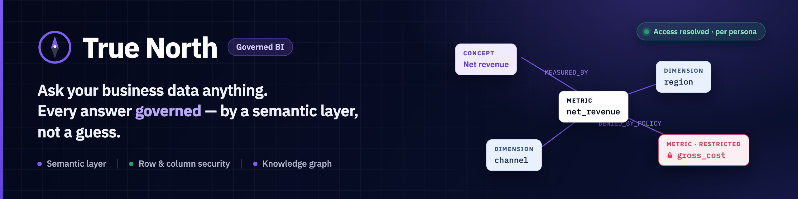
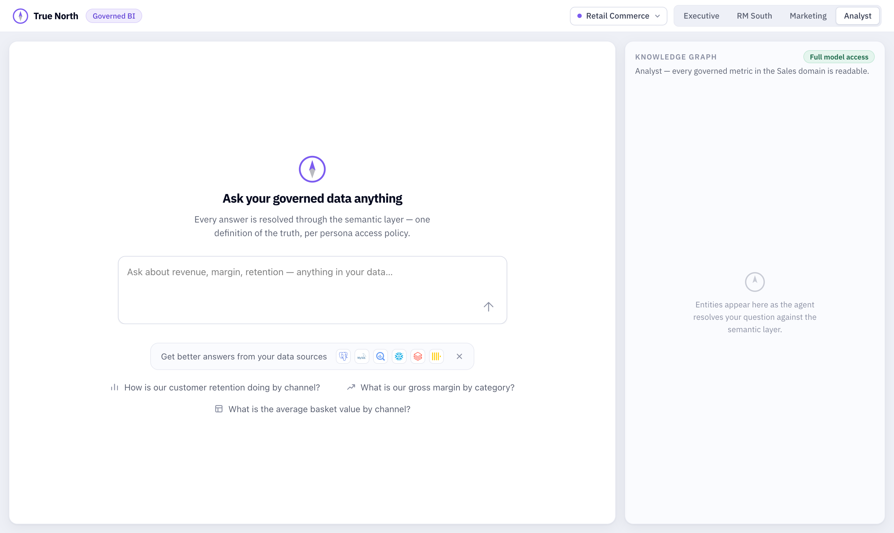
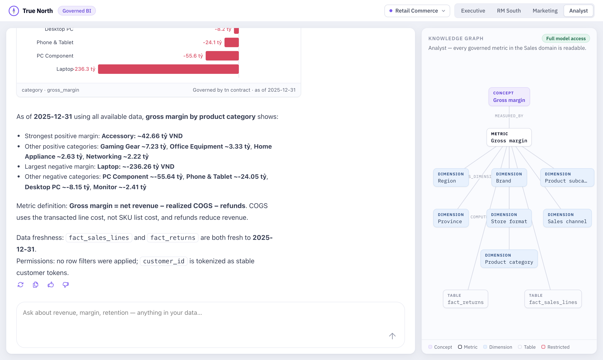
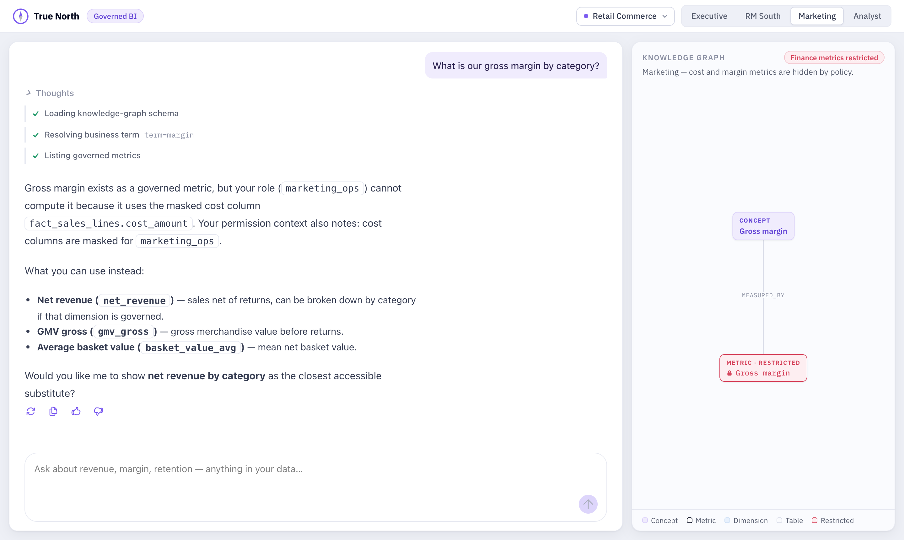
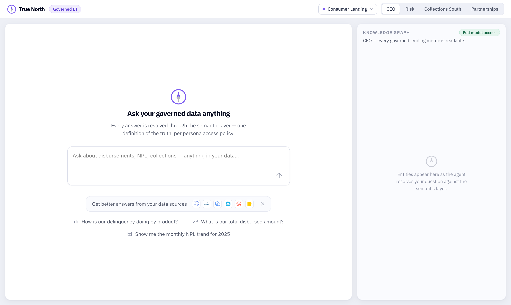

<p align="center">
  
</p>

# true-north

Governed self-service BI, built as a hackathon project: business users ask questions in natural language; an agent answers from a governed semantic layer with permissions, provenance, and a knowledge graph — instead of guessing SQL against raw tables.

The demo warehouse models **Phong Vũ** (phongvu.vn), a Vietnamese consumer-electronics retailer, as a synthetic star schema with deliberately planted traps a naive text-to-SQL agent falls into (see `source/data/TRAPS.md`).

## Screenshots

The workbench: a governed chat on the left, and a live knowledge-graph panel on the right that shows every entity an answer touched. The persona switcher (top right) changes who is asking; the data-source switcher changes which tenant you are in.



**A governed answer.** Ask for gross margin by category and the agent resolves the term through the semantic layer, returns a chart stamped *"Governed by tn contract"*, and states the metric definition, data freshness, and which permissions applied — with every metric, dimension, and table it read shown as typed nodes in the graph.



**Governance in the open.** The same question from the Marketing persona is refused — gross margin reads a masked cost column their role cannot see — so the agent explains *why*, offers the metrics they **can** use, and renders the blocked metric as a locked node in the graph. Access is never guessed; it is resolved per persona.



**One agent, many tenants.** Switch the data source to a consumer-lending warehouse and the personas, metrics, suggestions, and policies switch with it — the same governed CLI contract fronts both.



## Architecture

```
        ┌─────────────────────────────────────────────────┐
        │                 harness  (Phong)                │
        │           LLM agent · chat interface            │
        └────────────────────────┬────────────────────────┘
                                 │ governed CLI
                                 │ (auth token → user → permissions)
                 ┌───────────────┴─────────────┐
                 │ Cypher                      │ data queries (DSL)
        ┌────────▼──────────────┐   ┌──────────▼───────────┐
        │    knowledge-graph    │   │      governance      │
        │  Neo4j: glossary +    │   │  row-level security  │
        │  business knowledge;  │   │  column anonymization│
        │  ingests metrics/dims │   │  PII tokenization    │
        │  incl. permission     │   │  table access        │
        │  metadata             │   │                      │
        └────────┬──────────────┘   └──────────┬───────────┘
                 │ ingests semantic layer      │ queries
        ┌────────▼────────────────────────────▼────────────┐
        │                     source                       │
        │   DuckDB warehouse mock · semantic layer with    │
        │   governed metrics & dimensions · DSL/CLI        │
        └──────────────────────────────────────────────────┘
```

## Services

| Service | Owner | Responsibility | Interface (planned) |
|---|---|---|---|
| `source/` | Karsten | Mocked data warehouse (DuckDB) + semantic layer providing governed metrics & dimensions | DSL / CLI |
| `governance/` | Karsten | Row-level access security, column-level anonymization, PII tokenization, table access — applied per user | Authenticated query CLI (auth token resolves the user and their permissions) |
| `knowledge-graph/` | Karsten | Glossary + business knowledge; automatically ingests everything defined in the semantic layer (metrics, dimensions) **including permission metadata**, so answers can say "this metric exists but you don't have access" | Cypher, via the governed CLI |
| `harness/` | Phong | The agent on top: queries the knowledge graph for context, then the warehouse — both through the governed CLI | Chat |
| Postgres | Karsten | Runtime policy store (compiled from `users.yaml`) + one audit row per `tn` invocation (ADR 0010) | Read by the CLI at runtime; hydrated by `python -m governance.pg` |

The interface is specified in [`CONTRACT.md`](CONTRACT.md) — commands, output envelope, error semantics, KG data model, demo users. Interface changes land only as PRs editing that file. In short, the contract the harness consumes is a **single governed CLI**: every call carries an auth token that resolves to a user, and it fronts both surfaces — **Cypher against the knowledge graph** (the token lets permission metadata be injected into graph answers) and **data queries against the warehouse** (the token scopes row/column/table access). Exact interface specs are the next step — nothing beyond `source/` is implemented yet.

## Working in the repo

Python services are managed with **uv** as a workspace; run commands from inside a service directory:

```bash
cd source
uv run python -m generator.generate --scale small --seed 42   # build demo data
uv run python -m query.cli "SELECT count(*) FROM fact_sales_lines"
```

See `docs/USING-TN.md` for **how to use the `tn` CLI** (agent guide: the intended KG→query loop, error handling, and which requests the current replay stub answers), `source/README.md` for the dataset and generator details, `docs/phongvu-domain.md` for the domain research.
